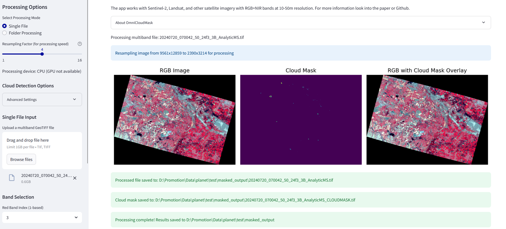

# Cloud Masking Application

A Streamlit application for detecting and masking clouds in satellite imagery using OmniCloudMask.



## About OmniCloudMask

OmniCloudMask (OCM) is a sensor-agnostic deep learning model that segments clouds and cloud shadows developed by [Nicholas Wright](https://github.com/wrignj08) and [Jordan A. Caraballo-Vega](https://github.com/jordancaraballo). It demonstrates robust state-of-the-art performance across various satellite platforms when classifying clear, cloud, and shadow classes, with balanced overall accuracy values across:
- **Landsat**: 91.5% clear, 91.5% cloud, and 75.2% shadow
- **Sentinel-2**: 92.2% clear, 91.2% cloud, and 80.5% shadow
- **PlanetScope**: 96.9% clear, 98.8% cloud, and 97.4% shadow

**GitHub**: [https://github.com/DPIRD-DMA/OmniCloudMask](https://github.com/DPIRD-DMA/OmniCloudMask)

**Paper**: [Training sensor-agnostic deep learning models for remote sensing: Achieving state-of-the-art cloud and cloud shadow identification with OmniCloudMask](https://www.sciencedirect.com/science/article/pii/S0034425725000987)

## Installation
1. Clone this repository:
```bash
conda create -n omnicloudmask python=3.9

conda activate omnicloudmask
```

2. Clone this repository:
```bash
git clone https://github.com/yourusername/cloud-masking-app.git
cd cloud-masking-app
```

3. Install the required packages:
```bash
pip install -r requirements.txt
```

## Running the Application

Start the Streamlit app:
```bash
streamlit run app.py --server.maxUploadSize 1000
```

The app will open in your default web browser, typically at http://localhost:8501.

## Features

- Process single multiband GeoTIFF files or folders of single-band files
- Automatic detection of file groups by date/tile
- Customizable resampling for faster processing
- GPU detection and utilization when available
- Advanced cloud detection parameters
- Visualization of results
- Batch processing

## Detailed Workflow

### 1. Input Selection

The application supports two main processing modes:

#### Single File Mode
- Upload a multiband GeoTIFF file through the interface
- Select the appropriate band indices for Red, Green, and NIR bands
- These bands are used for cloud detection

#### Folder Processing Mode
- Enter a path to a folder containing satellite imagery
- The app automatically detects and groups files by date and tile ID
- For multiband files, select which bands to use
- For single-band files, select which files represent the Red, Green, and NIR bands

### 2. Processing Options

Various processing options can be configured:

#### Basic Options
- **Resampling Factor**: Controls the resolution at which cloud detection runs
  - Higher values (2, 4, 8, 16) process faster but with less precision
  - Value of 1 means no resampling (full resolution)
- **Output Directory**: Where processed files will be saved (default: "masked_output")

#### Advanced Options
- **Patch Size**: Size of the patches for inference (default: 1000)
- **Patch Overlap**: Overlap between patches for inference (default: 300)
- **Batch Size**: Number of patches to process in a batch (default: 1)
- **Inference Data Type**: Data type for inference (float32, float16, or bfloat16)
- **Export Confidence**: If enabled, exports confidence maps instead of predicted classes
- **Apply Softmax**: Applies softmax to the output when exporting confidence maps
- **No Data Value**: Value that indicates no data in the input images
- **Apply No Data Mask**: Whether to apply a no-data mask to the predictions
- **Model Download Source**: Source for downloading model weights (Google Drive or Hugging Face)

### 3. Processing Steps

The application performs the following steps for cloud detection and masking:

1. **Data Loading**: Reads the selected bands from the input file(s)
2. **Resampling**: Downsamples the data based on the resampling factor for faster processing
3. **No-Data Trimming**: Identifies and trims regions with no data to improve efficiency
4. **Cloud Detection**: Applies the OmniCloudMask model to detect clouds and cloud shadows
5. **Visualization**: Displays the input image, detected clouds, and overlay
6. **Mask Upsampling**: For resampled data, upsamples the cloud mask back to original resolution
7. **Mask Application**: Sets cloud pixels to NoData value in all bands
8. **Output Generation**:
   - Saves masked versions of all input bands with original filenames
   - Creates a separate cloud mask file with "_CLOUDMASK" suffix

### 4. Output Files

The application generates the following output files in the specified output directory:

- **Masked Bands**: Original band files with cloud pixels set to NoData
- **Cloud Mask**: A binary GeoTIFF file with classes:
  - 0 = clear
  - 1 = Thick Cloud
  - 2 = Thin Cloud
  - 3 = Cloud Shadow
- **Visualization**: Optional PNG file showing the detection results

## Multicore Processing

The application supports multicore processing for batch operations, which can significantly speed up processing multiple files:

### How It Works

1. When you select **Folder Processing** mode, you'll see an option to **Use Multicore Processing**
2. If enabled, you can select the number of worker processes (parallel jobs) to use
3. The application will automatically distribute the workload across the specified number of CPU cores

### Performance Benefits

- **Linear Scaling**: Processing time typically decreases proportionally with more cores
- **Resource Utilization**: Makes efficient use of available CPU and memory resources
- **Progress Tracking**: The progress bar shows overall completion across all workers

### When to Use

- **Large Batch Jobs**: When processing many files or time periods
- **Multicore Systems**: Most beneficial on computers with 4+ CPU cores
- **Independent Files**: Each file/group is processed independently

### Resource Considerations

- **Memory Usage**: Each worker process requires its own memory allocation
- **GPU Utilization**: If using GPU acceleration, it will be shared among worker processes
- **System Load**: Using too many workers might slow down other applications

For optimal performance, set the number of workers based on your system's capabilities. A good starting point is to use the number of physical CPU cores minus one (to leave resources for the operating system).

## Application Structure

The application consists of multiple Python modules, each with a specific role:

- `app.py`: Main Streamlit application that handles the user interface
  - Manages file input/output
  - Provides options for processing parameters
  - Controls workflow execution

- `file_utils.py`: File utility functions
  - Finding raster files in directories
  - Checking if files are multiband
  - Grouping files by date and tile ID
  - Extracting band information

- `processing.py`: Image processing functions
  - Processing multiband files
  - Processing single-band files
  - Resampling and masking operations

- `cloud_detection.py`: Cloud detection module
  - Wrapper for OmniCloudMask's predict_from_array function
  - Handles interface between processing module and cloud detection model

- `visualization.py`: Visualization functions
  - Generating visualizations of input data, cloud mask, and overlay
  - Handling different output types (binary mask or confidence maps)

## Hardware Requirements

- **CPU**: Any modern CPU will work, but faster CPUs will process images more quickly
- **GPU**: CUDA-capable GPU recommended for faster processing
  - The app automatically detects and uses GPU if available
  - Falls back to CPU if no GPU is found
- **Memory**: At least 8GB RAM recommended, more for processing large images
- **Disk Space**: Sufficient space to store input and output imagery

## Troubleshooting

### Common Issues

- **File Format Errors**: Ensure input files are valid GeoTIFF files
- **Memory Errors**: When processing large files, try increasing the resampling factor
- **GPU Memory Issues**: Reduce batch size or patch size if experiencing CUDA out of memory errors

### Debug Tips

- Check the console output for error messages
- Inspect the intermediate visualization to verify cloud detection
- Try with a smaller test file if processing large datasets

## Citation

If you use this application in your research, please cite both this application and the OmniCloudMask paper:

```
@article{WRIGHT2025114694,
title = {Training sensor-agnostic deep learning models for remote sensing: Achieving state-of-the-art cloud and cloud shadow identification with OmniCloudMask},
journal = {Remote Sensing of Environment},
volume = {322},
pages = {114694},
year = {2025},
issn = {0034-4257},
doi = {https://doi.org/10.1016/j.rse.2025.114694},     
url = {https://www.sciencedirect.com/science/article/pii/S0034425725000987},
author = {Nicholas Wright and John M.A. Duncan and J. Nik Callow and Sally E. Thompson and Richard J. George},
keywords = {Sensor-agnostic, Deep learning, Cloud, Shadow, Sentinel-2, Landsat, PlanetScope}
}
```

## License

This application is released under the MIT License. See the LICENSE file for details.

## Contributing

Contributions are welcome! Please feel free to submit a Pull Request.

## Acknowledgments

- The OmniCloudMask team for their excellent cloud detection model
- The Streamlit team for their fantastic framework for building data applications
